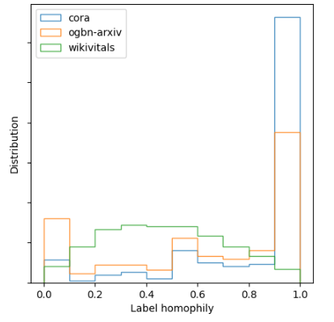
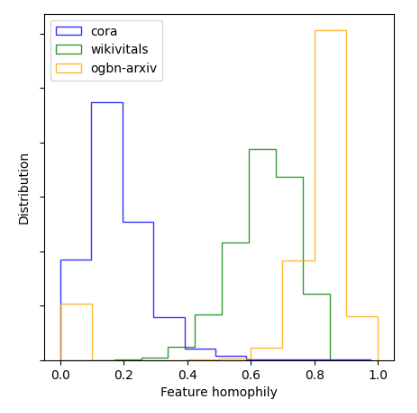

# Graph Neural Networks: The Surprising Superiority of Logistic Regression

This repository contains all the source code for reproducing our experiments. 

## Datasets

We use the following graph datasets in our experiments. All datasets are available in the `\data` directory.
In the following, $|V|$ denotes the number of nodes, $|E|$ the number of edges, $L$ the number of features, $C$ the number of labels, $\delta_A$ the edge density and $\delta_X$ the attribute density. 

|Dataset| $$\|V\|$$ | $\|E\|$ | $L$ | $C$ | $\delta_A$ | $\delta_X$ |
|-------|-----------|---------|-----|-----|------------|------------|
| Cora             | 2708  | 10556  | 1433  | 7   | 2.88e-03     | 1.27e-02     |
| Pubmed*          | 19717 | 88651  | 500   | 3   | 4.56e-04     | 1.00e-01     |
| Citeseer         | 3327  | 9104   | 3703  | 6   | 1.65e-03     | 8.54e-03     |
| Actor            | 7600  | 30019  | 932   | 5   | 1.04e-03     | 5.79e-03     |
| CS               | 18333 | 163788 | 6805  | 15  | 9.75e-04     | 8.76e-03     |
| Photo            | 7650  | 238162 | 745   | 8   | 8.14e-03     | 3.48e-01     |
| Cornell          | 183   | 298    | 1703  | 5   | 1.79e-02     | 5.54e-02     |
| Wisconsin        | 251   | 515    | 1703  | 5   | 1.64e-02     | 5.63e-02     |
| Wikivitals       | 10011 | 824999 | 37845 | 11  | 8.23e-03     | 3.60e-03     |
| Wikivitals-fr    | 9945  | 558427 | 28198 | 11  | 5.65e-03     | 3.12e-03     |
| Wikischools      | 4403  | 112834 | 20527 | 16  | 5.82e-03     | 5.25e-03     |
| Wikivitals+      | 45149 | 3946850| 85512 | 11  | 1.93e-03     | 1.24e-03     |
| ogbn-arxiv       | 169343 | 1166246| 128 | 40  | 8.14e-05     | 7.65e-04     |


## Usage

For a specific model, the `src/main.py` can be used with the following parameters:
```bash
--dataset         Graph dataset {cora, pubmed, ...}
--undirected      If true, force graph to be undirected 
--randomstate     Random state seed (default=8)
--k               Value for k-fold splits
--stratified      If true, perform stratified split in training folds (default=true)
--model           Model name {Diffusion, GCN, ...}
--use_features    [optional] If true, use features as input (for baseline models)
--use_concat      [optional] If true, use concatenation of adajcency and feature matrices as input (for baseline models)
```

For all experiments (not recommended), use:
```bash
./run.sh
```

## Additional material

We provide additional information about label homophily distribution. We observe that `ogbn-arxiv` and `Cora` exhibit relatively large label homophily, compared to `Wikivitals` graph.



Considering feature homophily, `ogbn-arxiv` highly differs from `Cora`.


